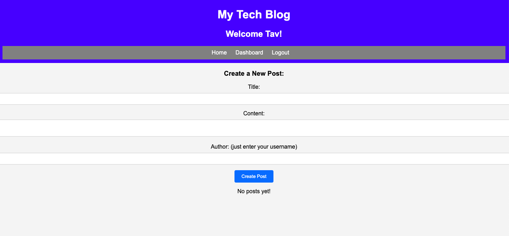

# Blog

## Description

This is a blogging site coded using a Model-View-Controller structure, featuring handlebars and sequelize.  Users can log in to read and write posts and comments.  There is a homepage for viewing all posts, a dashboard to create and edit posts, and an individual post view page which can add comments.  Users need to be logged in to access this site.  

## Link

[LINK](https://dry-river-45552-65f9dd09dfff.herokuapp.com/login)

## Screen

